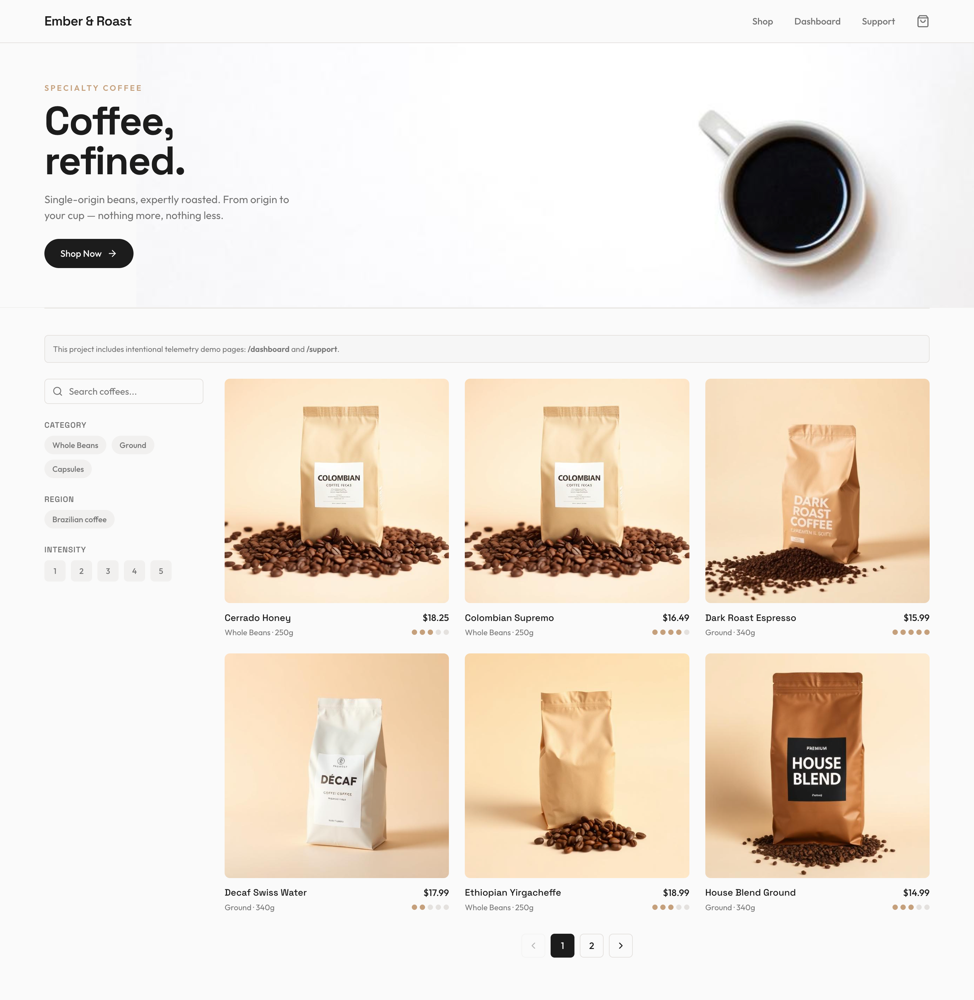

# Coffee Store

Frontend-first ecommerce app with observability instrumentation using Grafana Faro and Sentry.

This project includes intentional telemetry demo pages: `/dashboard` and `/support`.

Url: https://coffee-store-sample.vercel.app




## Observability Architecture

This project instruments frontend telemetry in four layers:

- **Automatic web telemetry (Faro):**
  - browser/web instrumentations
  - React Router integration
  - tracing instrumentation
- **Error monitoring (Sentry):**
  - React error boundary
  - exception capture with context
- **Performance telemetry (Web Vitals):**
  - `CLS`, `INP`, `LCP`, `FCP`, `TTFB`
- **Custom product telemetry:**
  - route changes
  - API latency and failures
  - critical user interactions (click tracking)

## What Is Tracked

### 1) SPA navigation

- `page_view`
- `route_change`

Tracked centrally via `RouteChangeTracker`, so page events are consistent and not duplicated across screens.

### 2) API behavior (frontend perspective)

For product endpoints, the app tracks:

- success events
- error events
- not-found events
- `durationMs` latency

Events:

- `api_products_ok`
- `api_products_failed`
- `api_product_ok`
- `api_product_failed`
- `api_product_not_found`

### 3) Critical click interactions

To detect "user clicked but flow did not continue":

- `checkout_entry_clicked`
- `add_to_cart_clicked`
- `checkout_submit_clicked`
- `checkout_submit_succeeded`
- `checkout_submit_failed`

In addition, Faro User Actions automatic instrumentation is enabled via
`data-faro-user-action-name` on critical controls:

- `shop-now-clicked`
- `add-to-cart`
- `proceed-to-checkout`
- `place-order`

### 4) Session and user context

Faro metadata includes:

- `session.id` (always present)
- `user.id` (when available in storage)

This enables filtering telemetry by session or logged-in user impact.

## Key Files

- `src/main.tsx`
- `src/App.tsx`
- `src/shared/lib/observability/logger.ts`
- `src/shared/lib/observability/RouteChangeTracker.tsx`
- `src/shared/lib/observability/webVitals.ts`
- `src/shared/lib/observability/identity.ts`
- `src/features/products/services/productService.ts`
- `src/pages/ProductDetail.tsx`
- `src/pages/CartPage.tsx`
- `src/pages/CheckoutPage.tsx`

## Run Locally

```bash
npm install
npm run dev:full
```

Frontend runs on `http://localhost:8080`.

## How To Validate Observability

1. Open the app and navigate: Home -> Product -> Cart -> Checkout.
2. Trigger key actions:
   - add to cart
   - proceed to checkout
   - submit checkout
3. In Grafana Faro:
   - check route/user-action events
   - inspect API event latency (`durationMs`)
   - inspect web vitals over the same time window
4. In Sentry:
   - confirm frontend exceptions are captured with context.

## In-App Dashboard

The app includes a first-party telemetry dashboard at `/dashboard` that reads real
structured observability records emitted by the frontend runtime (no mock data).

It summarizes:

- sessions
- JS exceptions
- API error count and average latency
- checkout funnel (`add to cart -> checkout -> submit -> success`)
- web vitals averages (`LCP`, `INP`, `CLS`)

## Observability Stress Test Page

Use `/support` to intentionally generate problematic telemetry and validate
monitoring behavior.

This page can trigger:

- slow main-thread interaction
- failing HTTP request
- burst user-action events
- intentional uncaught JavaScript error
- delayed layout insertion to provoke CLS

Light abuse protection is enabled on this page (max 5 stress actions every 10 seconds).

## Why This Matters

- Fast detection of frontend regressions
- Real user flow visibility in SPA navigation
- Better debugging for "clicked but nothing happened" cases
- Measurable UX performance using web vitals and API latency

## Go-Live Checklist

Before publishing, confirm:

- `VITE_API_BASE_URL` points to your production backend
- `VITE_FARO_URL` is configured in production environment
- `VITE_SENTRY_DSN` is configured (optional but recommended)
- `DATABASE_URL` is set with your Supabase Postgres connection
- `CORS_ORIGIN` matches your deployed frontend URL
- frontend build passes: `npm run build`
- backend build passes: `npm run build:backend`
- `/dashboard` and `/support` are reachable and telemetry is visible in Grafana
